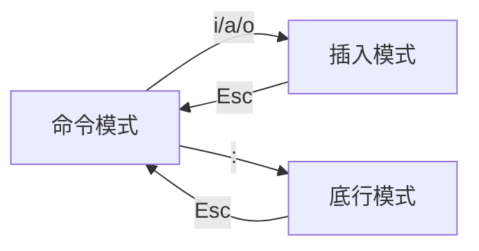

# vim

文本编辑器
格式：`vim <file>`

## 常见用法
```bash
# 打开文本
vim <file>
vim /path/to/<file>

```


## 扩展
### vim 的三种模式
|名称|作用|备注|
|:-|:-|:-|
|命令模式|使用快捷键操作字符||
|插入模式|自由输入字符||
|底行模式|操作整个文件||

### vim 的三种模式转换


### 命令模式下常用快捷键
|按键|作用|备注|
|:-|:-|:-|
|`i`|进入插入模式|在光标前面|
|`a`|进入插入模式|在光标后面|
|`o`|进入插入模式|在光标下一行|
|`:`|进入底行模式||
|`dd`|剪切光标所在的行|前面加数字可以改变行数|
|`dw`|剪切光标所在的单词|前面加数字可以改变单词数|
|`yy`|复制光标所在的行|前面加数字可以改变行数|
|`ZZ`|保存退出||
|`p`|粘贴到光标下一行||
|`x`|删除光标所在的字符|单个字符|
|`C`|删除光标后的所有内容|进入插入模式|
|`r`|替换光标所在的字符|`r` 之后输入想要替换的字符|
|`u`|回退||
|`$`|光标移动到行尾||
|`0`|光标移动到行头||
|`gg`|光标移动到第一行||
|`G`|光标移动到最后一行||
|`/str`|搜索 `str`|`n`下一个，`N`上一个|

### 底行模式下常用命令
|命令|作用|备注|
|:-|:-|:-|
|`:w`|保存||
|`:q`|退出||
|`:x`|保存并退出|同`:wq`|
|`:!`|强制模式|配合`wq`使用，如`:q!`|
|`:set nu`|加行号||
|`:set nonu`|取消行号||
|`:line`|跳转到 `line` 行||
|`:%s/old/new/`|替换每一行的第一个 `old` 为 `new`|加 `g` 全局替换|
|`:nohl`|取消高亮||